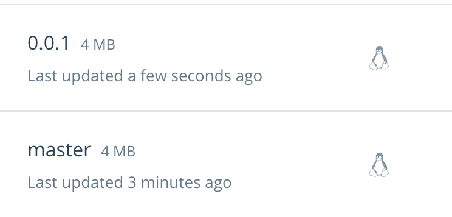

[](https://travis-ci.org/marco-m/travis-go-dockerhub)

How to use TravisCI to build Go code in a Docker image and publish to DockerHub.

## WORK IN PROGRESS

## DockerHub token setup

Do now use your DockerHub password, create a dedicated access token instead, see documentation at [dockerhub access tokens](https://docs.docker.com/docker-hub/access-tokens/). Login to your account and go to Settings | Security. Create a token, give it a name such as `Travis` and securely back it up in your OS key store.

The token can be used with `docker login` as if it was a password.

## Travis token setup

Follow the [travis encryption-keys](https://docs.travis-ci.com/user/encryption-keys/) documentation to install the `travis` CLI.

For macOS, `brew install travis` just works.

Do not follow the documentation example (`travis encrypt SOMEVAR="secretvalue"`), because it would leave the secrets in the shell history. Instead, run the tool in interactive mode.

```
$ cd the-repo
$ travis encrypt --add -i
Detected repository as marco-m/travis-go-dockerhub, is this correct? |yes|
Reading from stdin, press Ctrl+D when done
DOCKER_TOKEN="YOUR_TOKEN"  <= this is a real secret
THE_SECRET="42"            <= this shows how to pass additional secrets; see the tests
```

The `--add` will add the entry to the `.travis.yml` file.

## Travis Docker build

See

* The Travis documentation [Using Docker in Builds](https://docs.travis-ci.com/user/docker/).
* The file `travis.yml` in this repo.
* The file `Taskfile.yml` in this repo.

## Releases and tags

With reference to the corresponding [repository on DockerHub](https://cloud.docker.com/repository/docker/marcomm/travis-go-dockerhub/general):

Each time a commit is made on a branch, a new Docker image will be pushed with a tag corresponding to the branch name. This is done to enable integration testing of the image before merging.

If a branch is tagged (you should tag only the default branch), then a new Docker image will be pushed with the corresponding tag, without the optional `v` prefix.

For example:



**NOT YET, FIXME:** Each time a release is made, the `latest` tag is updated.

## Local build

The same Taskfile can be used for local builds, for CI builds and inside a Docker container.

For easiness of customizations, you need to setup some environment variables.

Use a **secure means** to protect the environment variables, since some of them are sensitive, such as the DockerHub token!

We suggest to use [envchain](https://github.com/sorah/envchain) or [gopass](https://github.com/gopasspw/gopass).

### Setup envchain

```
envchain --set travis-docker DOCKER_USERNAME

$ envchain --set travis-docker DOCKER_TOKEN
travis-docker.DOCKER_TOKEN: YOUR_TOKEN_HERE

$ envchain --set travis-docker THE_SECRET
travis-docker.THE_SECRET: 42
```

### Build

```
$ envchain travis-docker task test
$ envchain travis-docker task build

$ envchain travis-docker task docker-build
$ envchain travis-docker task docker-smoke
$ envchain travis-docker task docker-push
```
